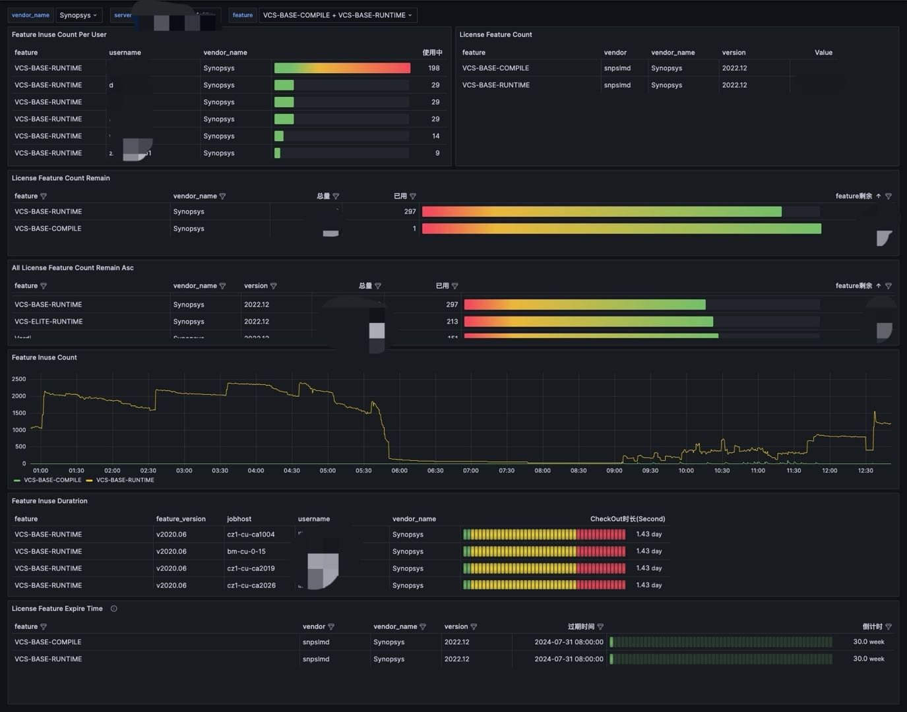

# pyFlexNetLicenseMonitor
FlexNet License Status Monitor Written in Python



### Description

---

### Requirements

---

developed with Python 3.9 and Grafana 10
- Python.
- Grafana. 
- Prometheus. 


### Usage

---

1. rename config-sample.yaml to config.yaml. Change config.yaml file with your own license server infomation, add more server if need
```angular2html
interval: 30
debug: 0
license:
  - name: <VENDOR1>
    lmutilpath: <DIR>/lmutil
    licensepath: <PORT1>@<SERVER1>
    licensefilepath: <DIR>/snpslmd.txt
  - name: <VENDOR2>
    lmutilpath: <DIR>/lmutil
    licensepath: <PORT2>@<SERVER2>
    licensefilepath: <DIR>/snpslmd.txt

```

2. Build docker image
```angular2html
docker buildx build --platform=linux/amd64 -t pyflexnetlicensemonitor .
```

3. rename deployment-sample.yml to deployment.yml and change config if deploy to k8s

### License

---

MIT